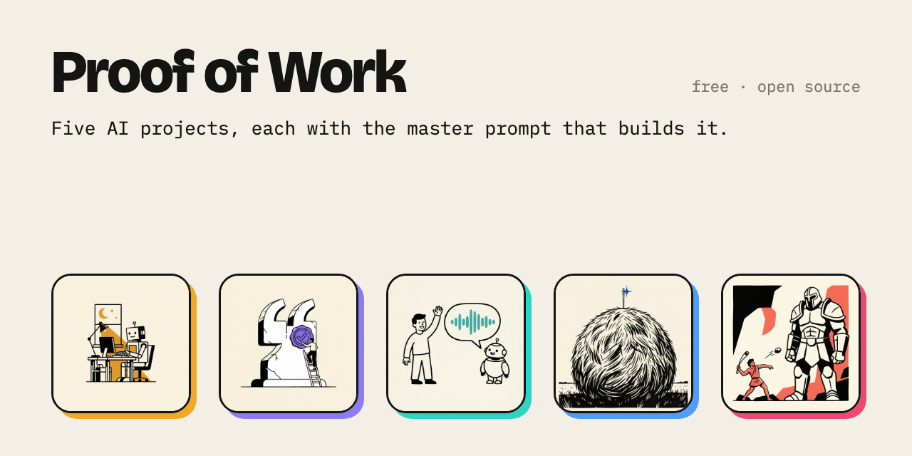
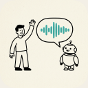
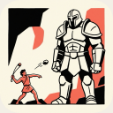

# Proof of Work

Five portfolio projects that make an AI engineer's GitHub say "you built that?", each with a hands-on guide and a master prompt that lets Claude Code build it with you.

Every project has a $0 path. Four run on your own machine with Ollama and other open models. David vs Goliath's fine-tune trains on Colab's free T4 or on Apple Silicon, and its free-path baseline is the Gemini free tier or a local model. Each guide's "Free and local" section says what changes.

|  | Project | What it is | The number you publish | Weeks |
|---|---|---|---|---|
|  | [The Night Shift](projects/01-the-night-shift/) | A coding agent scored by a benchmark's own tests | Resolved rate on 50 SWE-bench Verified-mini instances, with a 95% interval | 3 to 4 |
|  | [Citation Needed](projects/02-citation-needed/) | A research agent whose every cited sentence is checked | Citation precision and recall over 50 questions | 2 to 3 |
|  | [Hello, World](projects/03-hello-world/) | A real-time voice agent that obeys an interruption mid-sentence | p50 and p95 from end of speech to first audio, over 100 turns | 2 to 3 |
|  | [Needle in a Haystack](projects/04-needle-in-a-haystack/) | Hybrid retrieval over a million chunks, latency on the page | recall@10 and nDCG@10 on 200 or more labelled questions | 2 to 3 |
|  | [David vs Goliath](projects/05-david-vs-goliath/) | A small fine-tune measured against a frontier model | Fine-tuned against a frontier model on 1,000 or more held-out examples, with the cost ratio | 1 to 2 |

## How to use one

1. Make an empty folder and run `git init` in it.
2. Paste the project's `PROMPT.md` into Claude Code as your first message, whole.
3. Answer the interview, read the spec it writes, then build one phase at a time.

[HOW-TO-USE.md](HOW-TO-USE.md) covers the mechanics, including what to answer and what changes on the local path.

## Why these five

Evaluation appears in all eleven AI engineer postings read in full for this repo, retrieval and agents in ten of them, fine-tuning in two. Each of the five leads with a number a recruiter can check in a minute, and [WHY-THESE-FIVE.md](WHY-THESE-FIVE.md) shows the postings and the counts behind the choice.

## What the prompts do

Each `PROMPT.md` works the same way.

- It interviews you before it writes anything: provider path, hardware, corpus or dataset, a budget cap in dollars, how many weeks you have.
- It writes a spec and a phase plan, then stops. You approve those two files, or cut a phase and lower a target while changing your mind is still free.
- Every phase ends in a number and a checkpoint. A phase whose result cannot be measured does not close.
- Three phases are mandatory on every build: an eval set with unit tests on toy cases where the answer is known by hand, a cost log carrying p50 and p95 per backend with dated prices, and a `PREFLIGHT.md` of the defects you hit, each one as what was wrong, the number that showed it, the fix, the number after.
- One switch chooses the API path or the local path. The code takes both, and the eval table carries a row per backend, so the local run is a result rather than a downgrade.

## Honesty

This repo ships guides and prompts, and no results of its own. The five builds have not been run here. The prompts were written from the sources each guide cites and reviewed line by line, and every reference number in a guide is somebody else's published work, linked in that guide's Sources section. The numbers you get from a build are yours. [RESULTS.md](RESULTS.md) is where readers add them, one row per run, each row linking the repo it came from.

That split is deliberate. A repo that handed you working code would hand every reader the same number, and a number you did not produce answers no interview question.

## Licences

MIT for the scripts and tests ([LICENSE](LICENSE)). CC BY 4.0 for the guides, prompts and icons ([LICENSE-CONTENT](LICENSE-CONTENT)). The five project illustrations were generated with Google Gemini. [CONTRIBUTING.md](CONTRIBUTING.md) says what a pull request may change.

By Itay Cohen, [github.com/itayco2](https://github.com/itayco2).
