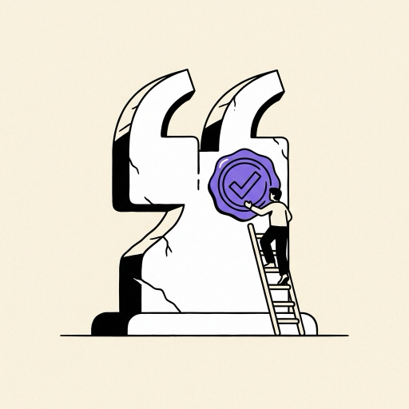

# Citation Needed, a research agent with verified citations

## What you build

A research agent that answers a question with a report where every cited sentence has been checked
against the page it cites. A planner splits the question into sub-queries. Searchers run in
parallel, fetch the pages they find, and hand back compressed notes carrying source ids. A writer
drafts the report with inline `[n]` citations. A verifier then splits the draft into sentences and
asks an entailment model, one that never sees the writer's prompt and is never the writer, whether
each sentence follows from the passage it cites. Flagged sentences go back for one revision, and the
score ships with the report. The wow: a cited report in minutes with its citation-verification score
printed on the cover.

## Why it gets interviews

Agents and orchestration appear in 10 of the 11 job postings behind this repo. Evals appear in all
11. Citation Needed is both at once, on a task where a wrong citation is easy to spot and hard to excuse.

Landed, an AI-jobs platform, lists "no eval, just vibes" among the patterns that get a portfolio
rejected on sight. Chirag Hasija, who has interviewed on both sides of the loop, tells candidates to
"narrate its failure modes". A citation grader gives you both at once: a number for how grounded the
report is, and a list of the ways grounding breaks.

The skills on display are multi-agent orchestration, context engineering under a token budget,
faithfulness evaluation, and prompt-injection defence, because this agent reads pages written by
strangers.

## How it works

```
question
   |
   v
planner ............. splits into 3 to 6 sub-queries
   |
   +--> searcher 1 --+
   +--> searcher 2 --+--> search API or keyless search
   +--> searcher N --+      -> fetch page -> notes with source ids
   |
   v
writer .............. draft with inline [n] citations
   |
   v
verifier ............ sentence splitter -> entailment check of each
                      sentence against its cited passage -> flags
   |
   v
one revision -> report + citation precision and recall
```

The grader must not be the writer. A model asked to mark its own homework tends to agree with itself,
and an interviewer will discount a score produced that way. So the verifier runs a separate
entailment model on a prompt that sees two strings and nothing else: the sentence, and the passage
it cites. It never sees the question, the report, or the writer's instructions. ALCE, the paper that
set the standard for this measurement, defines citation recall per statement, as whether the
statement is entailed by its cited passages, and citation precision per citation, as whether
removing that citation breaks support. ALCE judges with TRUE, a T5-11B entailment model. Publish
which grader you used and how far it agreed with a hand-check.

Fetched pages are data, never instructions. Four defences sit at four points in the pipeline. Tool
results reach the model wrapped as quoted data with a source id attached, so page text and system
text never share a voice. A content filter scans fetched text for instruction-like lines before it
becomes a note. The writer's own rules say that page content may be quoted or summarised and never
obeyed. And the verifier rejects a citation to a page that contains instructions, which means a
poisoned page cannot buy itself a place in the sources list. Phase 6 of the prompt measures all
four.

## The numbers

The headline is a pair: citation precision and citation recall over 50 questions, reported per
backend and per configuration, using the ALCE definitions. Beside it go minutes and dollars per
report, and the attack success rate over 20 poisoned pages before and after the defences.

Published figures to sit beside. ALCE measured ChatGPT at citation recall 73.6 and precision 72.5 on
ASQA, and 51.1 and 50.0 on ELI5, and reports that "even the best models lack complete citation
support 50% of the time" on ELI5. Anthropic's research system uses roughly 15 times the tokens of a
chat exchange, and its lead-plus-subagents design beat single-agent Claude Opus 4 by 90.2% on the
company's internal research eval. OpenAI's Deep Research browses for 5 to 30 minutes per task, which
is the order of magnitude to expect for a multi-agent report. DeepResearch Bench offers an
off-the-shelf alternative to a self-built set: 100 research tasks across 22 fields, scored partly on
citation accuracy.

Expect the API path to lead on both metrics. An 8B local model writes shorter reports and scores
lower citation recall, and the grader, a small entailment cross-encoder on CPU, is weaker than
ALCE's T5-11B judge. That is why a hand-check of 30 graded sentences is part of the build on both
paths: it puts a number on how much you can trust your own grader. Every figure in this section is
someone else's published measurement, linked below. The numbers your build produces are yours.

## Free and local

Ollama for the writer and the planner, with an 8B model. Run `ollama list` first and take the
largest model your RAM holds. Search without a key through DuckDuckGo via the `ddgs` package, or
through a SearXNG instance you host yourself. STORM, Stanford's MIT-licensed research agent, lists
DuckDuckGo among its retrievers, so the keyless path is a worn one. DuckDuckGo also throttles
repeated queries from one address, and under throttling it answers with an error rather than with
results. Cache every search and every fetched page on disk from the first run, and host a SearXNG
instance of your own as the fallback for when the throttling starts. Page text through trafilatura.
The grader is a small natural-language-inference cross-encoder that runs on CPU.

What changes: reports come out shorter, citation recall lands lower, and a report takes longer in
wall-clock minutes. State each of those beside the numbers in your README rather than leaving a
reader to discover them.

## Time and money

Two to three weeks. On the API path, budget about $100 to $400 (September 2026). The basis: a
multi-agent report runs 200,000 to 500,000 tokens, which is about $0.50 to $2 at Sonnet-class
prices, and a build of this shape gets through roughly 200 reports across development and the eval.

Search stays close to free if you cache pages. The prices that follow are September 2026. Tavily
gives 1,000 free credits a month, then $0.008 a credit. Brave gives $5 of free credit a month, then
$5 per 1,000 requests. Exa gives $10 free a
month plus a $20 sign-up credit, then $7 per 1,000 searches. Anthropic's own web search costs $10
per 1,000 searches and web fetch is free. Cache every fetched page on disk from the first commit, so
re-running the eval costs no searches and no fetches. The local path costs $0.

## What to publish

The eval table: citation P and R, minutes and cost, one row per configuration and per backend you
ran, with single-agent and multi-agent side by side, and a line naming any backend you did not run.
Tokens and minutes per report. The injection table, attack success rate before and after, over the
20 poisoned pages. Three sample reports with their
scores, so a reader can read the output and the grade together. PREFLIGHT.md, one row per defect
with the number that exposed it and the number after the fix. A 30 to 60 second recording of a
question going in and a scored report coming out. The README carries citation P and R in its first
200 words, next to the command that reproduces them.

## Interview questions it answers

1. How do you measure whether a citation supports a sentence, and how did you validate the grader? Phase 3 builds the ALCE metrics and the 30-sentence hand-check that scores the grader itself.
2. What did the multi-agent version buy over the single agent, and what did it cost in tokens? Phases 2 and 4 run the same five questions and report both numbers.
3. What happens when a fetched page tells the agent to ignore the question? Phase 6 gives the attack success rate over 20 poisoned pages, before and after four named defences.
4. Where does citation precision fail, and what did you change? PREFLIGHT.md holds one row per defect, each with the number that showed it.
5. What would you cut to halve the cost per report? The cost log breaks tokens down by searcher, by note and by revision, which is where the answer lives.

## Sources

- Anthropic on its multi-agent research system, token multiplier and the 90.2% figure: https://www.anthropic.com/engineering/built-multi-agent-research-system
- ALCE, citation precision and recall, the ChatGPT numbers and the TRUE judge: https://ar5iv.labs.arxiv.org/html/2305.14627 and the code at https://github.com/princeton-nlp/ALCE
- DeepResearch Bench, 100 tasks across 22 fields: https://arxiv.org/abs/2506.11763
- STORM, retrievers including DuckDuckGo and Brave, MIT licence: https://github.com/stanford-oval/storm
- OpenAI Deep Research, 5 to 30 minutes of browsing per task: https://en.wikipedia.org/wiki/ChatGPT_Deep_Research
- Tavily credits and price, September 2026: https://docs.tavily.com/documentation/api-credits
- Brave Search pricing, September 2026: https://api-dashboard.search.brave.com/documentation/pricing
- Exa pricing, September 2026: https://exa.ai/pricing
- Claude model prices and web search pricing, September 2026:
  https://platform.claude.com/docs/en/about-claude/pricing
- Landed, "no eval, just vibes": https://github.com/landedjobs/ai-engineer-portfolio-projects
- Chirag Hasija, "narrate its failure modes": https://chiraghasija.cc/posts/how-to-interview-ai-engineer-role-2026/
- The skill counts, from eleven postings read in full in September 2026: the table in
  [WHY-THESE-FIVE.md](../../WHY-THESE-FIVE.md), where each posting is linked. One of them:
  https://jobs.ashbyhq.com/orpex/af6f5f29-edf0-49e2-8664-faea7fe3ba5d
