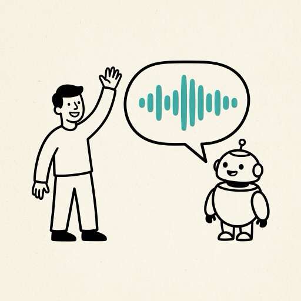

# Concierge: a real-time voice agent

## What you build

A page with a microphone button. You say "anything Thursday evening for two?" and it starts
answering while you are still settling back in your chair. It checks a calendar mid-sentence, offers
you a slot, and writes the booking. Cut it off halfway through a reply and it stops talking inside
300 ms.

Underneath: audio streams from the browser to a server, a voice activity detector decides when you
stopped talking, speech to text runs on the stream, the model streams tokens and calls tools against
a local SQLite calendar, and speech synthesis streams audio back in chunks that play as they arrive.
Every turn is timestamped at five points, and those timestamps become a table.

The part that makes people watch the recording twice is the interruption. You talk over it and it
obeys.

## Why it gets interviews

Agents and tool calling appear in 10 of the 11 AI engineer postings surveyed for this repo. Serving,
latency and cost appear in 5, and WITHIN's posting names "Observability, model routing, latency
management, and cost control". Chirag Hasija, who has sat on both sides of the interview loop, puts
the bar plainly: "A feature that works but costs $2 per request and takes 30 seconds does not ship."

Plenty of candidates can describe a streaming API. Fewer can say where the milliseconds in one turn
went. Fewer still can name the change that moved p50 and give the number before and after it. You
come out of this able to talk about streaming, latency engineering, tool use during a live
conversation, and how to score a conversation without asking a model to grade its own work.

## How it works

```
  browser mic
      |
      |  WebRTC (or a WebSocket on the local path)
      v
  VAD  ---> end of speech at t0
      |
      v
  STT  ---> partials while you talk, final transcript at t1
      |
      v
  LLM  ---> first token at t2, streaming, with tools:
      |       check_availability / book / cancel
      |       against a local SQLite calendar
      v
  TTS  ---> first audio byte at t3, streamed in chunks
      |
      v
  playback in the page ---> first sound in your ear at t4

  barge-in: speech at the mic while audio is playing
      ---> cancel TTS, cancel the model turn, flush the audio queue
```

The clock starts when the detector says you stopped. From there, speech to text has to finish a
final transcript (t1), the model has to emit a first token (t2), synthesis has to produce a first
audio byte (t3), and the page has to get that byte into the output device (t4). Only t2 is really
about the model. t0 is a threshold you picked: set the silence window at 700 ms and you have spent
700 ms before anything else begins. t1 and t3 are network round trips on the API path, and on a
conference-hotel connection they dominate the whole budget. t4 is buffer size in the page. The
network and turn detection set the floor, not the model, which is why the first useful thing you
build is the per-stage timing that tells you which of the five is eating the second.

Interruption is a cancellation problem across three streams that all have to stop: synthesis
upstream, the audio queue in the page, and the model turn that is still producing tokens you no
longer want. Test it mechanically rather than by talking over it yourself. Play a recorded reply,
inject a new utterance at a known offset, and measure wall-clock time from the first sample of the
injected speech to the last sample the player emitted. Run 20 attempts at different offsets,
including inside the first 200 ms of a reply and in the middle of a tool call. A pass is all 20 under
300 ms, with a log line per attempt carrying the measured stop. Run it in headless Chrome with a
fake audio device, so the injected utterance is a file on disk and the stop time comes from the page's
own log rather than from your ear.

## The numbers

Three numbers you produce:

- p50 and p95 from end of speech to first audio, over 100 turns, per backend, broken out by the five
  stages above.
- Task completion over 30 scripted conversations, judged by reading the calendar rows afterwards.
- 20 of 20 interruptions honoured within 300 ms.

Reference points from other people's measurements, so you know whether yours is sane:

- An independent benchmark of two speech-to-speech APIs, run on 40-turn sessions and published 30
  August 2026, measured end of speech to first response audio byte at a p50 of 1,064 ms for Gemini
  Live and 1,253 ms for OpenAI Realtime. The same runs recorded per-turn cost growth by turn 40 of
  17.3x for Gemini against 1.25x for OpenAI, a context-handling difference worth knowing before you
  commit to one.
- τ-Voice (March 2026, 278 tasks) found a text agent completing 85% of tasks while voice agents
  landed 31 to 51% on clean audio and 26 to 38% on realistic audio. A completion rate near 50% on
  your 30 conversations is the neighbourhood, not a broken build.
- ElevenLabs quotes roughly 75 ms for Flash v2.5, which is the order of magnitude a hosted synthesis
  step costs you when it is fast.

On the local path, expect slower, and say so beside the number. With no API in the run, the two rows
in every table are two local configurations, a larger one and a smaller one, so name which two. A
CPU-only stack pays real seconds for speech to text and synthesis on top of a local model's first
token. Publish what you measured on
your own machine rather than a figure borrowed from someone with a GPU. The measurement is the claim.

## Free and local

faster-whisper for speech to text (MIT). Silero VAD for end of speech. Ollama for the model.
Kokoro-82M for speech (Apache 2.0). A WebSocket from the page rather than WebRTC, which keeps the
server to one process and removes the signalling step. Check the language before you commit to the
voice: Kokoro ships English, Japanese, Mandarin, Spanish, French, Hindi, Italian and Portuguese, so a
conversation in Hebrew, German, Arabic or Russian needs a different local voice, and Piper (MIT)
covers far more languages than Kokoro does. faster-whisper's own figures show what the speech step
costs: a 13-minute file transcribes in 16 seconds with large-v2 int8 on a GPU and in 51 seconds with
the small model on CPU. On 16 GB and no GPU, run the small or base model, keep
utterances short, and accept a turn measured in seconds.

Two permissively licensed frameworks already wire this pipeline together, Pipecat (BSD-2) and LiveKit
Agents (Apache-2.0). Write your own loop so you can answer for every millisecond in it, and read
their transport code when your own audio queue misbehaves.

## Time and money

2 to 3 weeks of evenings. The API path runs about $30 to $100 (prices September 2026). OpenAI's
gpt-realtime-mini is $10 in and $20 out per million audio tokens, against $32 and $64 for full
gpt-realtime; Gemini 2.5 Flash Native Audio is $3 and $12 and has a free tier. Browser-only is
supported without a phone number: your server mints an ephemeral key at
`/v1/realtime/client_secrets` and the page connects directly, and OpenAI's guide says "we recommend
using WebRTC rather than WebSockets" from a browser. If you build the pipeline arm instead, Deepgram
Nova-3 streaming is $0.0048 a minute on promotional pricing with a $200 credit for new accounts, its
Aura-2 synthesis is $0.030 per 1,000 characters, and Cartesia's free tier gives 20,000 credits a
month. The local path is $0.

## What to publish

The per-stage latency table, one row per backend. The completion rate over 30 conversations. The
interruption test log, all 20 lines. Cost per minute of conversation per backend. `PREFLIGHT.md`
with every defect and the number that exposed it. The recording, which is the demo: 30 to 60 seconds
of a real conversation including one interruption.

## Interview questions it answers

1. Where do the milliseconds go in a turn?
2. How does barge-in work, and how did you test it?
3. How did you evaluate task completion without a model as judge?
4. What single change moved p50 the most?
5. What does a minute of conversation cost on each backend?

## Sources

- OpenAI API pricing (gpt-realtime, gpt-realtime-mini): https://developers.openai.com/api/docs/pricing
- OpenAI realtime voice over WebRTC, including the ephemeral-key flow and the WebRTC recommendation: https://developers.openai.com/api/docs/guides/voice-webrtc
- Gemini API pricing (2.5 Flash Native Audio, free tier): https://ai.google.dev/gemini-api/docs/pricing
- voice-benchmarks, the independent latency and cost-growth measurement: https://github.com/virevolai/voice-benchmarks
- τ-Voice, task completion for voice agents (arXiv 2603.13686): https://arxiv.org/abs/2603.13686
- Deepgram pricing (Nova-3 streaming, Aura-2, the $200 credit): https://deepgram.com/pricing
- ElevenLabs model overview (Flash v2.5 latency): https://elevenlabs.io/docs/overview/models
- Cartesia pricing (free tier): https://www.cartesia.ai/pricing
- Pipecat, a BSD-2 voice pipeline framework: https://github.com/pipecat-ai/pipecat
- LiveKit Agents, Apache-2.0: https://github.com/livekit/agents
- faster-whisper, with its transcription timings: https://github.com/SYSTRAN/faster-whisper
- Kokoro-82M, Apache 2.0 speech synthesis: https://huggingface.co/hexgrad/Kokoro-82M
- Silero VAD: https://github.com/snakers4/silero-vad
- Piper, MIT-licensed local speech synthesis with voices in many more languages: https://github.com/rhasspy/piper
- The eleven postings behind the skill counts, with their URLs: [WHY-THESE-FIVE.md](../../WHY-THESE-FIVE.md)
- WITHIN's AI engineer posting: https://job-boards.greenhouse.io/agencywithin/jobs/5056863007
- Chirag Hasija on interviewing for AI engineer roles: https://chiraghasija.cc/posts/how-to-interview-ai-engineer-role-2026/
